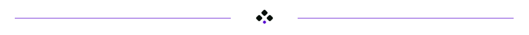

    
Your here already so why not follow :D

    

---

     

About me:
 * Computers = cool 😎 👍 
 * I specialize with: Networking, Hacking, Machine learning, Automation, and being a professional dumbass :P
 * Fluent with; Assembly, python‚ C‚ C＋＋‚ C＃‚ html‚ Makefile‚ Batch‚ VBS‚ JavaScript‚ Java‚ SQL‚ PHP‚ Nim‚ Ruby‚ GoLang‚ bash‚ shell‚ Typescript‚ rust‚ swift‚ lua‚ haskell‚ ruby and a few others <3
 

  

 

# STATS    

My Stats

 
           
name|statistics
----|----
All used Languages (This doesn't actually show all of the languages i have used, it shows all of the ones uploaded to my github profile and how much i use such language) | 
Streak | 
Comments & contributions |  
Trophies | 
Holopin | 
Octoring | <table><tbody><tr><td>  </td></tr></tbody></table>

