You sit there looking at my profile, mabye even a few repos. Then to slowly glance towards my profile picture. As you look at it your attention soon turns towards my following. You think to yourself "wow, this user has a lot of followers" you then click of the page and think "haha, they dont need any more, they probably have a few people follow and unfollow every day, why should i care". In reality though outside of your thoughts the truth is that i put in all of this work to make specific tools for specific uses but i get nothing in return. im not asking for a coffie or 20$, but a follow would be nice! hey, even the follow and veiw ratio is a little strange. be different!

    

---

     

**About me**:

 * 17
 * I specialize.
 * Interested in machine learning, Malware analisis, Hacking, GPU programming, kernel devlopment, Boot-secter devlopment, firmware devlopment, High level, mid level, and low level programming, graphical design, taking apart; modding, and putting back together tech. Destroying chromebooks
 * I've been working extensively with Assembly, Batch, Python, javascript, node, and java. Mainly have been busy with personal projects and a Minecraft server
 * I also enjoy making simple automation tools, mostly every repo I make here is one.

**Quotes**:
 * Love is a whispered promise in darkness, the gentle touch that soothes the scars we never show, and the quiet strength that holds us together when the world outside is falling apart. It's the accumulation of every laugh, every tear, and every moment we've shared with the ones who make our hearts beat. And yet, it's also the ache of longing, the weight of memories, and the bittersweet knowledge that our time together is limited. Love is the beauty and the brutality, the joy and the sorrow, the forever and the fleeting – all intertwined, all inseparable, and all worth fighting for. 

  

 

# STATS    

CLICK ON ME TO SHOW 'CPScripts' USER STATISTICS

 
           
name|statistics
----|----
Languages | <a href="https://en.wikipedia.org/wiki/Assembly_language"> 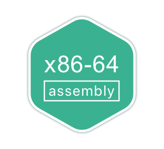 </a> <a href="https://en.wikipedia.org/wiki/Assembly_language"> 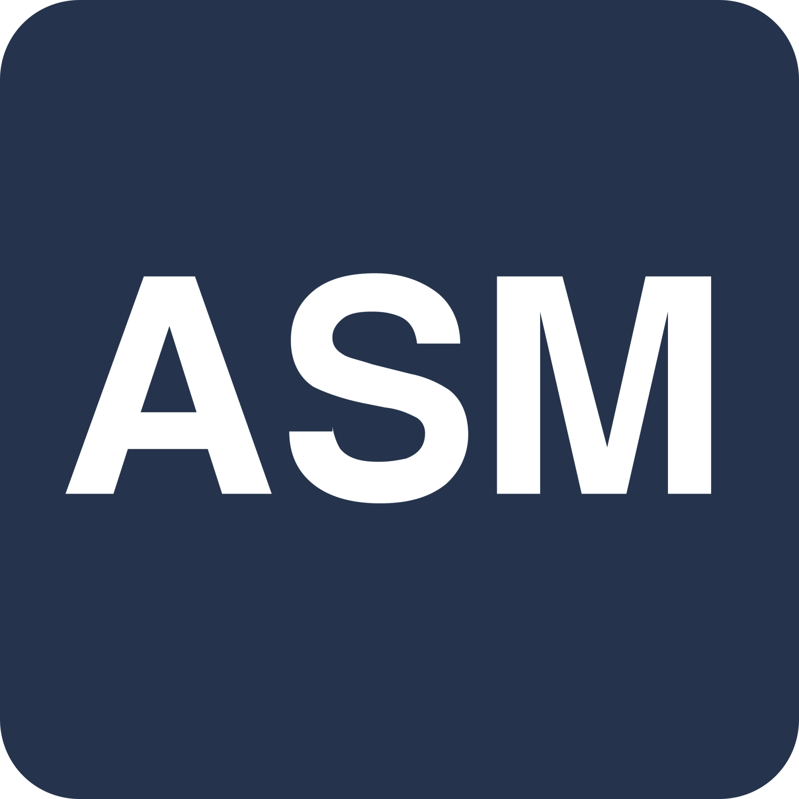 </a>  <a href="https://en.wikipedia.org/wiki/Bash_(Unix_shell)"> 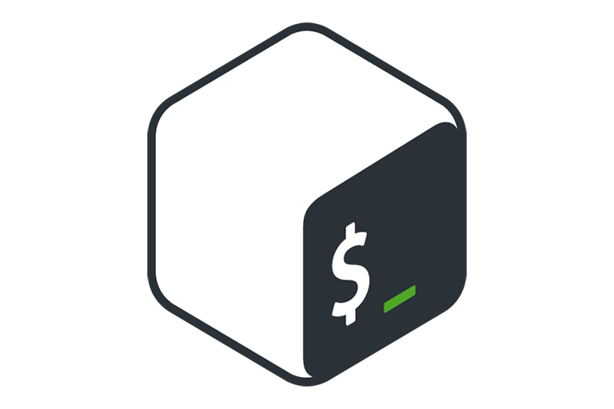 </a> <a href="https://en.wikipedia.org/wiki/C_(programming_language)"> 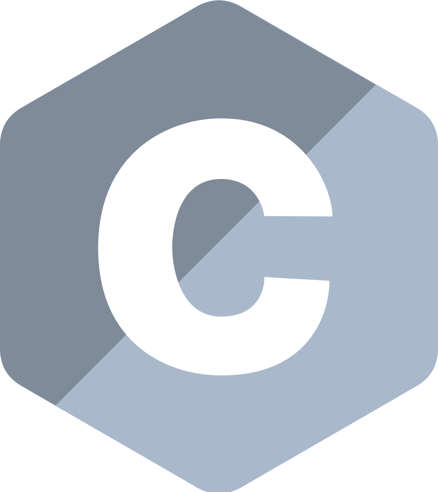 </a>   <a href="https://javascript.com"> 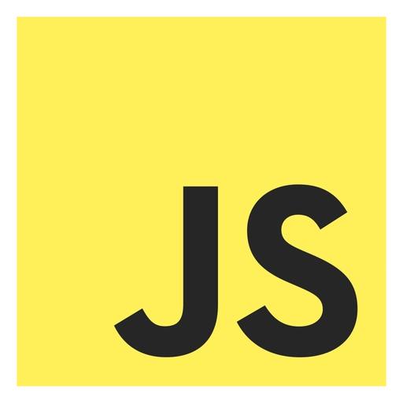 </a> <a href="https://java.com"> 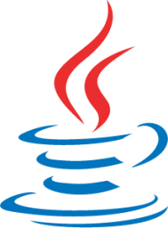 </a> <a href="https://Haskell.org"> 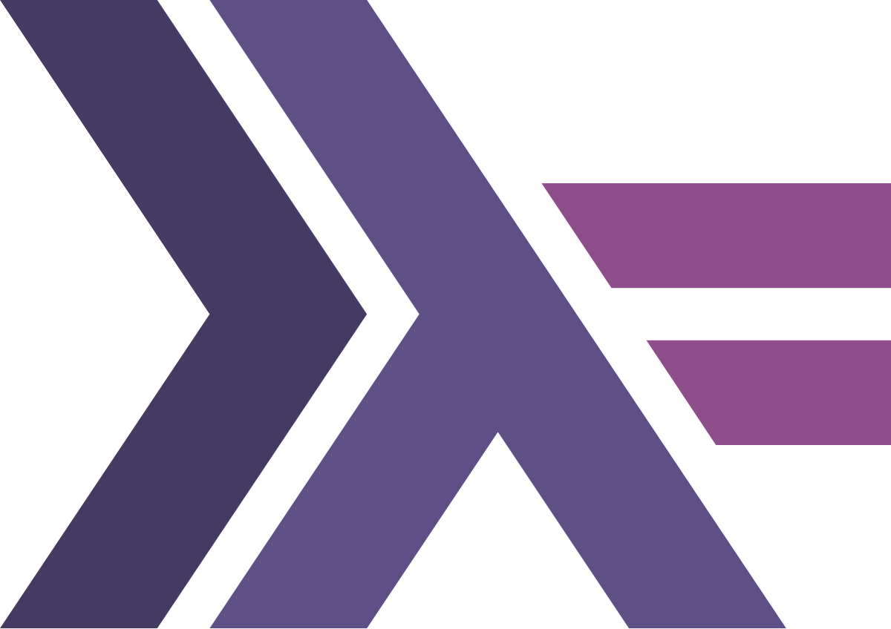 </a> <a href="https://learn.microsoft.com/en-us/office/vba/outlook/how-to/using-visual-basic-to-customize-outlook-forms/using-visual-basic-scripting-edition"> 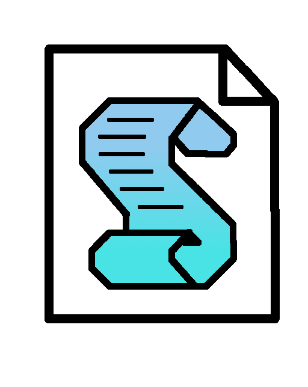 </a> <a href="https://lua.org"> 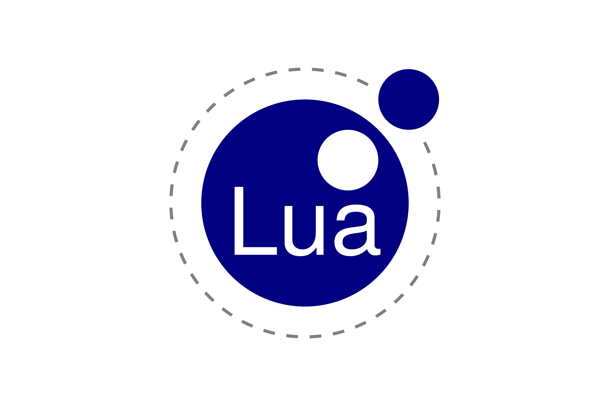 </a> <a href="https://mysql.com"> 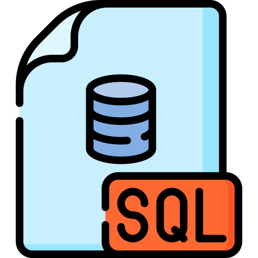 </a>  <a href="https://go.dev"> 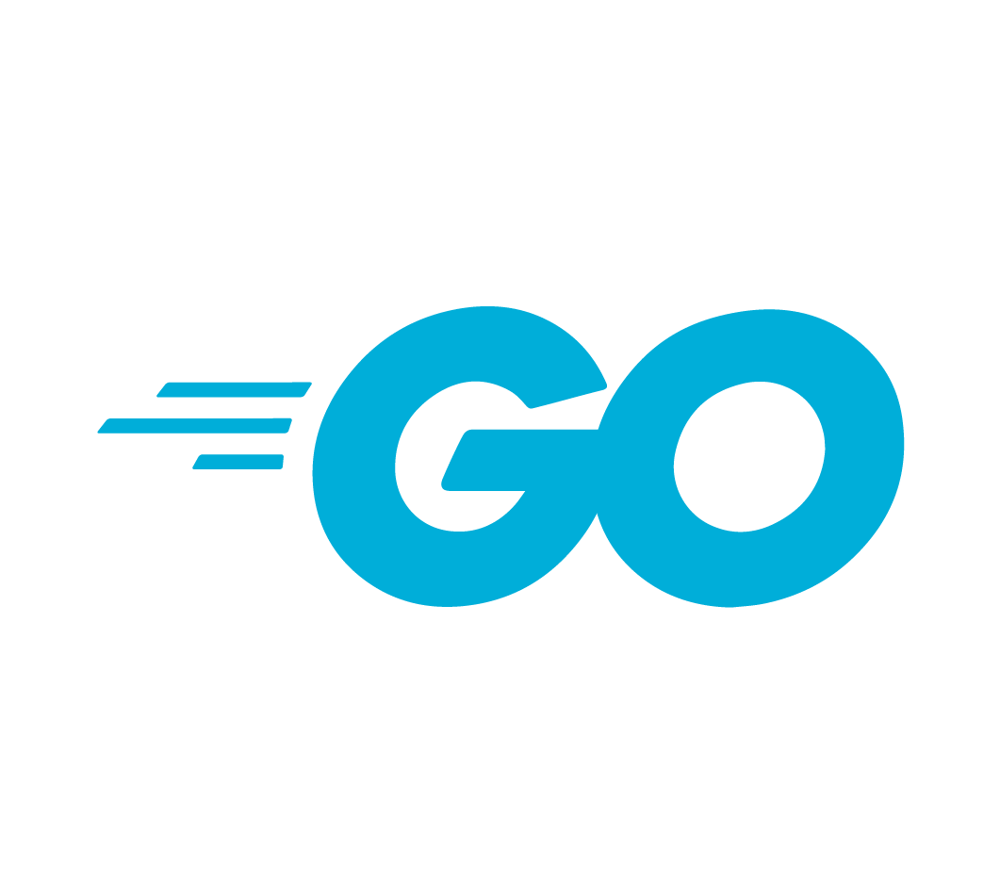 </a>        
Cloud (I don't like the cloud)|  <a href="https://www.digitalocean.com"> 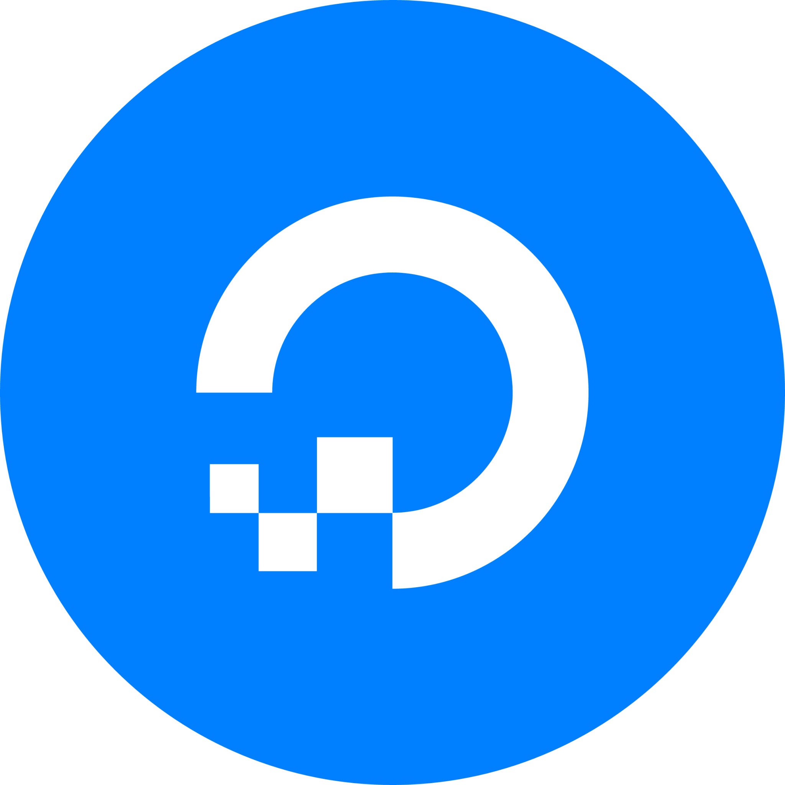 </a> 
Operating systems (i rarely use raspbain and osmore)| <a href="https://osmora.org/cgit/Hyra"> 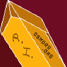.<"> </a>  <a href="https://www.apple.com/macos/macos-sequoia"> 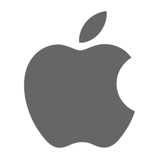 </a> <a href="https://archlinux.org/"> 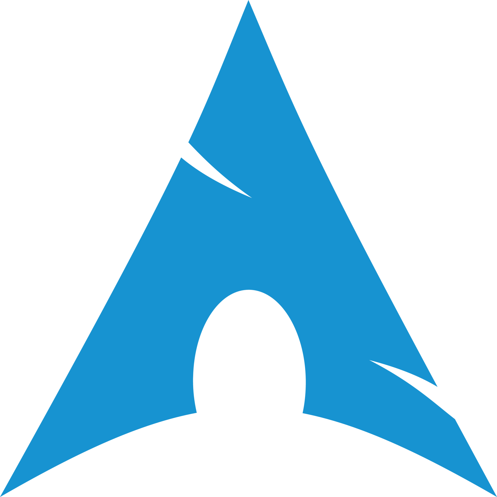 </a> <a href="https://www.kali.org"> 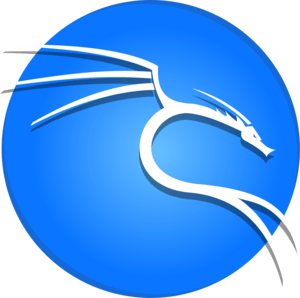 </a>   <a href="https://www.debian.org/"> 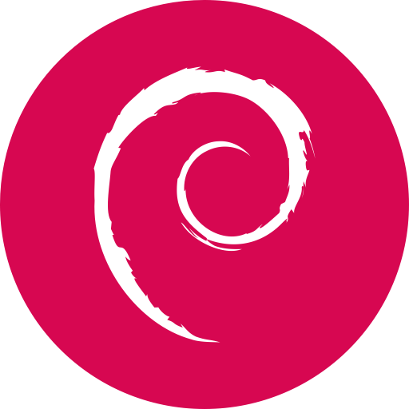 </a> <a href="https://www.raspbian.org/"> 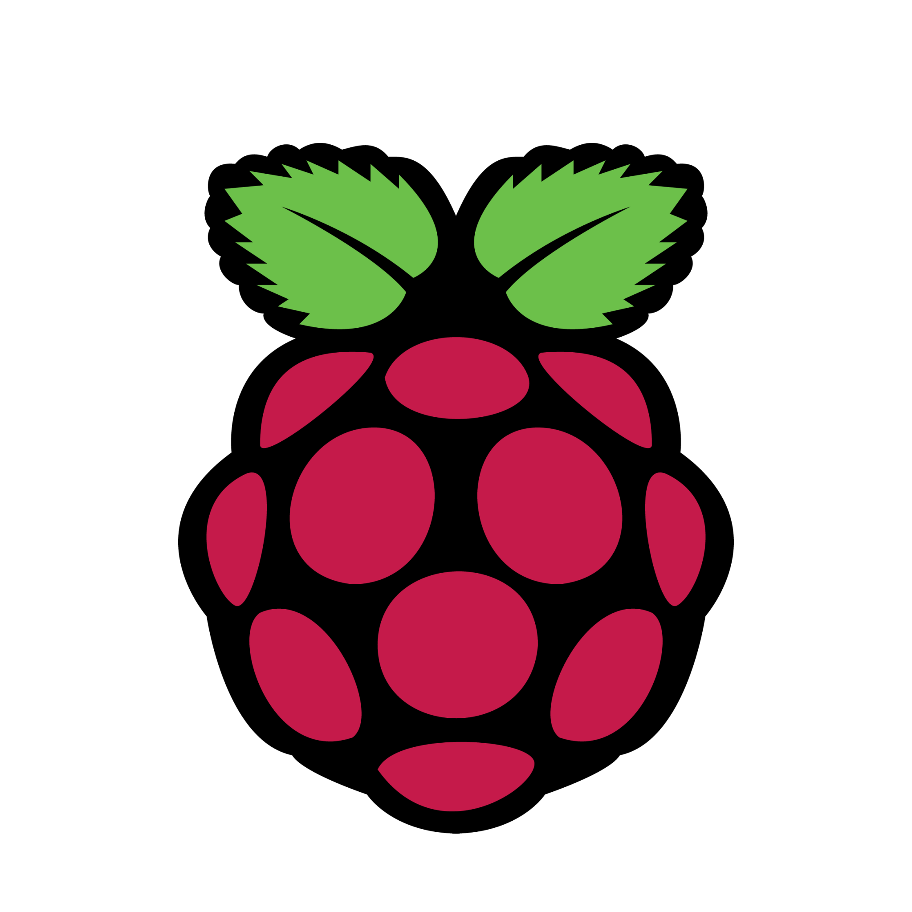 </a> 
All uploaded repo Langs (This doesn't actually show all of the languages i have used, it shows all of the ones uploaded to my github profile and how much i use such language) (This chart confuses me as I don't remember using some of them!) | 
Streak | 
Comments & contributions |  
Trophies | 
Octoring | <table><tbody><tr><td>  </td></tr></tbody></table>

