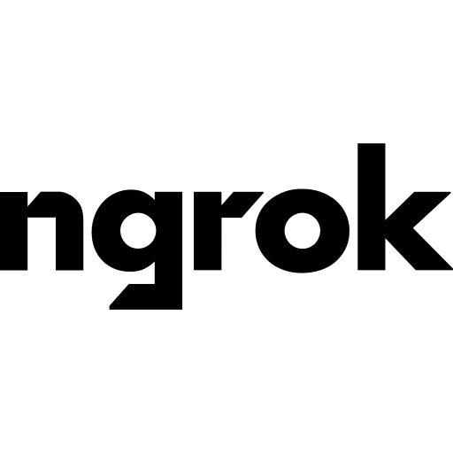

<div align=center>    


</div>

---
You' know. People say that love is about finding the right person, when in reality love is about becoming the right person. Dont look for the person you want to spend your life with, become the person you want to spend your life with.

*“Code is like humor. When you have to explain it, it’s bad.”* – **Cory House**

---
<div align="left">     

**About me**:

 * **Contact me:** *contact-disease.unelected107@passmail.net*
 * I specialize.

<div align="center">
  
</div> 

<div align="left">


For an image of dimensions $W \times H$, the RGB color value at pixel coordinate $(m, n)$ where $m \in \{1, 2, ..., W\}$ and $n \in \{1, 2, ..., H\}$ is defined by the vectorized function:

$$\Psi(m, n) = \left(R\left(f_r\left(\frac{m-\frac{W}{2}}{\eta}, \frac{n-\frac{H}{2}}{\eta}\right)\right), G\left(f_g\left(\frac{m-\frac{W}{2}}{\eta}, \frac{n-\frac{H}{2}}{\eta}\right)\right), B\left(f_b\left(\frac{m-\frac{W}{2}}{\eta}, \frac{n-\frac{H}{2}}{\eta}\right)\right)\right)$$

where $\eta$ is the scaling factor and $R, G, B$ are channel-specific transform functions defined as:

$$R(x) = 255e^{-\alpha_r\|x\|^2}\left|x\right|^{\beta_r+\delta_r\sin(\gamma_r\|x\|)}$$

$$G(x) = 255e^{-\alpha_g\|x\|^2}\left|x\right|^{\beta_g+\delta_g\sin(\gamma_g\|x\|)}$$

$$B(x) = 255e^{-\alpha_b\|x\|^2}\left|x\right|^{\beta_b+\delta_b\sin(\gamma_b\|x\|)}$$

The core spatial transformation functions $f_r, f_g, f_b$ involve the metric-distortion tensor $\mathcal{M}(x, y)$ and relativistic correction factor $\Lambda(x, y)$:

$$\mathcal{M}(x, y) = \mathcal{K}_s(x, y) + \frac{1-A_{\Omega}(x, y)}{10}\cdot\zeta^2\cdot e^{-\kappa\|r(x,y)\|^2} + \xi^3\cdot e^{-\sigma\|r(x,y)\|^2}$$

where $r(x, y) = \sqrt{x^2 + y^2}$ represents the radial distance from the origin, and:

$$\mathcal{K}_s(x, y) = \sum_{i=1}^{5}\frac{8+25\mathcal{R}(x, y)}{20}L_i(x, y)e^{-\tau_i\sqrt{\|\mathcal{E}_i(x,y)\|^2+\|\mathcal{F}_i(x,y)\|^2+\|\mathcal{G}_i(x,y)\|^2+\|\mathcal{H}_i(x,y)\|^2}}$$

$$A_{\Omega}(x, y) = \left(\prod_{i=1}^{3}C_{a,i}(x, y)\right)\left(\prod_{j=1}^{3}C_{b,j}(x, y)\right)$$

The accretion disk model function $C_{a,i}(x, y)$ and event horizon geometry $C_{b,j}(x, y)$ are given by:

$$C_{a,i}(x, y) = e^{-\frac{\lambda_{a,i}}{\ln(\|x\|^2+\|y\|^2+\epsilon)}\left(\sqrt{\|x\|^4+\|y\|^4}+\mathcal{D}(x,y)\right)}$$

$$C_{b,j}(x, y) = e^{-\frac{\|x\|^2+\mu\|y\|^2+\nu}{\ln(\|x\|^2+\|y\|^2+\epsilon)}\left(\sqrt{\|x\|^2+\|y\|^2+\phi}+\mathcal{D}(x,y)^{\rho_{j}}\right)}$$

The relativistic distortion mapping $\mathcal{D}(x, y)$ incorporates gravitational lensing effects:

$$\mathcal{D}(x, y) = \frac{2-v}{2}e^{\tau\sin(v\|x\|)\cos(v\|y\|)} - \frac{v^2-v+2}{20}e^{\kappa\cos(v\|x\|)\sin(v\|y\|)} \cdot e^{\alpha_{\mathcal{D}}\|r(x,y)\|^2}$$

The spiral arm function generating the galactic structures is defined as:

$$L_i(x, y) = e^{\lambda\sqrt{\|P_i(x,y)\|^2+\|Q_i(x,y)\|^2}} \cdot \cos\{7[\cos(4\pi)P_i(x,y)+\sin(4\pi)Q_i(x,y)]+2\cos\{4\sin([27+v\pi]P_i(x,y)+4\sin([27+v\pi)Q_i(x,y))+4\cos(3\pi)\}\}$$

where the parametric spiral components $P_i$ and $Q_i$ are:

$$P_i(x, y) = \left(x + (1-3v)^2\frac{1}{2} + \frac{9}{10}\right)\cos\left(\frac{3+v}{7}\ln(W_i(x, y))\right) + \left(y - (1-3v)^2\frac{1}{4} + \frac{13}{20}\right)\sin\left(\frac{3+v}{7}\ln(W_i(x, y))\right)$$

$$Q_i(x, y) = \left(x + (1-3v)^2\frac{1}{2} + \frac{9}{10}\right)\sin\left(\frac{3+v}{7}\ln(W_i(x, y))\right) - \left(y - (1-3v)^2\frac{1}{4} + \frac{13}{20}\right)\cos\left(\frac{3+v}{7}\ln(W_i(x, y))\right)$$

The radial metric function $W_i(x, y)$ and light-streak tensor $E_i(x, y)$ complete the model:

$$W_i(x, y) = \left(x + (1-3v)^2\frac{1}{2} + \frac{9}{10}\right)^2 + \left(2+3v\right)\left(y - (1-3v)^2\frac{1}{4} + \frac{13}{20}\right)^2 + 10^{-7}$$

$$E_i(x, y) = \sum_{k=1}^{3}\frac{3+57v}{240}(23-2v)^{-1}20^k V_{a,i}(x, y)$$

The final velocity field function $V_{a,i}(x, y)$ that models relativistic effects near the event horizon:

$$V_{a,i}(x, y) = \cos(5[14-3v]^{-1}10^{-11}(1+3\cos(10^{-3}))(\cos(2v^2)x+\sin(2v^2)y)) + 4\cos([14-3v]^{-1}10^{-10}(\cos(10^{-3})x+\sin(10^{-3})y)) + 2\cos(5v)$$ 

$$\times \cos(5[14-3v]^{-1}10^{-11}(1+3\cos(10^{-3}))(\cos(2v^2)y-\sin(2v^2)x)) + 4\cos([14-3v]^{-1}10^{-10}(\cos(10^{-3})y+\sin(10^{-3})x)) + 2\cos(5v)$$

The optimal parametric values for accurate astrophysical representation are:
- $\alpha_r = 1.5, \alpha_g = 2.0, \alpha_b = 2.5$
- $\beta_r = 0.7, \beta_g = 0.4, \beta_b = 0.2$
- $\gamma_r = 3.0, \gamma_g = 4.0, \gamma_b = 5.0$
- $\delta_r = 0.2, \delta_g = 0.15, \delta_b = 0.1$
- $\epsilon = 10^{-6}, \phi = 10^{-4}, \rho_j \in \{1.2, 1.5, 1.8\}$
- $\lambda = 1.5, \tau = 2.3, \kappa = 0.8, \sigma = 1.2$
- $\mu = 1.2, \nu = 0.7, v = 0.4$
- $\zeta = 0.8, \xi = 0.5$
- $\tau_i \in \{0.3, 0.6, 0.9, 1.2, 1.5\}$
- $\lambda_{a,i} \in \{0.7, 1.1, 1.5\}$
- $\alpha_{\mathcal{D}} = -0.3$
- $\eta = 200$

```
#define BLACK_HOLE_RADIUS 1.0
#define SCHWARZSCHILD_RADIUS 0.4
#define ACCRETION_DISK_INNER 1.0
#define ACCRETION_DISK_OUTER 4.0
#define ACCRETION_DISK_THICKNESS 0.1
#define DISK_TEMPERATURE_SCALE 1.5
#define LENSING_STRENGTH 2.5
#define DOPPLER_STRENGTH 1.2
#define GRAVITATIONAL_REDSHIFT 0.9
#define ROTATION_SPEED 0.2
#define STAR_DENSITY 200.0
#define DUST_DENSITY 0.4

float hash(vec2 p) {
    p = fract(p * vec2(123.45, 678.91));
    p += dot(p, p + 45.32);
    return fract(p.x * p.y);
}

float noise(vec2 p) {
    vec2 i = floor(p);
    vec2 f = fract(p);
    f = f * f * (3.0 - 2.0 * f);

    float a = hash(i);
    float b = hash(i + vec2(1.0, 0.0));
    float c = hash(i + vec2(0.0, 1.0));
    float d = hash(i + vec2(1.0, 1.0));

    return mix(mix(a, b, f.x), mix(c, d, f.x), f.y);
}

vec3 starField(vec2 uv, float time) {
    float stars1 = pow(noise(uv * STAR_DENSITY), 20.0) * 1.0;
    float stars2 = pow(noise(uv * STAR_DENSITY * 0.5 + 30.0), 20.0) * 1.5;
    float stars3 = pow(noise(uv * STAR_DENSITY * 0.25 + 10.0), 20.0) * 2.0;
    
    stars1 *= 0.8 + 0.2 * sin(time * 1.5 + uv.x * 10.0);
    stars2 *= 0.8 + 0.2 * sin(time * 0.7 + uv.y * 12.0);
    stars3 *= 0.8 + 0.2 * cos(time * 1.0 + uv.x * uv.y * 5.0);

    vec3 color1 = vec3(0.8, 0.9, 1.0) * stars1; 
    vec3 color2 = vec3(1.0, 0.9, 0.7) * stars2; 
    vec3 color3 = vec3(1.0, 0.6, 0.5) * stars3; 
    
    return color1 + color2 + color3;
}

vec3 nebulaEffect(vec2 uv, float time) {
    vec3 nebula = vec3(0.0);
    float t = time * 0.05;
    
    float n1 = noise(uv * 1.0 + t);
    float n2 = noise(uv * 2.0 - t * 0.5);
    float n3 = noise(uv * 4.0 + t * 0.2);
    
    float nebulaNoise = pow(n1 * n2 * n3, 3.0) * DUST_DENSITY;
    
    nebula += vec3(0.2, 0.1, 0.3) * nebulaNoise * 2.0; 
    nebula += vec3(0.1, 0.2, 0.4) * nebulaNoise * 1.5;
    nebula += vec3(0.3, 0.1, 0.2) * pow(n3, 4.0) * 0.8;
    
    return nebula;
}

vec3 dopplerShift(vec3 color, float velocity) {
    float doppler = 1.0 + velocity * DOPPLER_STRENGTH;

    return vec3(
        color.r * (velocity < 0.0 ? 1.0/doppler : 1.0),
        color.g,
        color.b * (velocity > 0.0 ? 1.0/doppler : 1.0)
    );
}

vec3 temperatureColor(float temperature) {
    vec3 color = vec3(1.0);
    
    color.r = pow(temperature, 1.5);
    
    color.g = pow(temperature, 2.0) * (1.0 - temperature * 0.5);
    
    color.b = pow(temperature, 3.0) * (1.0 - temperature * 0.8);
    
    color = normalize(color) * pow(temperature, 1.5);
    
    return color;
}

vec2 raytrace(vec2 uv, float radius, float lensStrength) {
    float r = length(uv);
    float theta = atan(uv.y, uv.x);
    
    float bendingFactor = lensStrength * SCHWARZSCHILD_RADIUS / max(r, 0.001);
    float bendingAmount = 1.0 / (1.0 + pow(r / radius, 2.0) * exp(-bendingFactor));
    
    float newRadius = mix(r, radius * radius / r, bendingAmount);
    
    return vec2(cos(theta), sin(theta)) * newRadius;
}

void mainImage(out vec4 fragColor, in vec2 fragCoord) {
    vec2 uv = (fragCoord - 0.5 * iResolution.xy) / iResolution.y;
    
    float time = iTime * 0.5;
    
    vec2 lensedUV = raytrace(uv, BLACK_HOLE_RADIUS, LENSING_STRENGTH);
    
    float r = length(lensedUV);
    float theta = atan(lensedUV.y, lensedUV.x);
    
    float rotatedTheta = theta + time * ROTATION_SPEED;
    vec2 diskUV = vec2(r * cos(rotatedTheta), r * sin(rotatedTheta));
    
    float diskDistance = abs(diskUV.y) / ACCRETION_DISK_THICKNESS;
    float diskRadius = length(diskUV);
    float diskMask = smoothstep(ACCRETION_DISK_INNER, ACCRETION_DISK_INNER + 0.1, diskRadius) *
                     smoothstep(ACCRETION_DISK_OUTER + 0.1, ACCRETION_DISK_OUTER, diskRadius) *
                     smoothstep(1.0, 0.0, diskDistance);
    
    float temperature = mix(0.3, 1.0, smoothstep(ACCRETION_DISK_OUTER, ACCRETION_DISK_INNER, diskRadius)) * DISK_TEMPERATURE_SCALE;
    vec3 diskColor = temperatureColor(temperature);
    
    float velocity = sin(rotatedTheta) * 0.8 * smoothstep(ACCRETION_DISK_OUTER, ACCRETION_DISK_INNER, diskRadius);
    diskColor = dopplerShift(diskColor, velocity);
    
    float redshiftFactor = mix(1.0, GRAVITATIONAL_REDSHIFT, smoothstep(ACCRETION_DISK_OUTER * 0.5, ACCRETION_DISK_INNER, diskRadius));
    diskColor *= redshiftFactor;
    
    float blackHoleMask = 1.0 - smoothstep(SCHWARZSCHILD_RADIUS * 0.9, SCHWARZSCHILD_RADIUS, r);

    vec2 starUV = mix(uv, lensedUV, smoothstep(5.0, 1.0, length(uv)));
    vec3 stars = starField(starUV * 0.5, time);
    
    vec3 nebula = nebulaEffect(starUV * 0.2, time) * 0.3;
    
    float photonRing = smoothstep(SCHWARZSCHILD_RADIUS - 0.03, SCHWARZSCHILD_RADIUS, r) * 
                       smoothstep(SCHWARZSCHILD_RADIUS + 0.03, SCHWARZSCHILD_RADIUS, r);
    vec3 photonRingColor = vec3(1.0, 0.8, 0.6) * 5.0 * photonRing;
    
    float blueShiftGlow = pow(max(0.0, -sin(rotatedTheta)), 4.0) * diskMask * 2.0;
    vec3 blueShiftColor = vec3(0.5, 0.7, 1.0) * blueShiftGlow;
    
    vec3 color = vec3(0.0);
    
    color += (stars + nebula) * (1.0 - blackHoleMask);
    
    color += diskColor * diskMask * 3.0;
    
    color += photonRingColor;
    
    color += blueShiftColor;
    
    color += max(vec3(0.0), color - 1.0) * 0.5;

    color = pow(color, vec3(0.8)); 
    color = (color - 0.1) * 1.1;
    
    fragColor = vec4(max(vec3(0.0), color), 1.0);
}
```

---

# STATS    
<details closed>
<summary>CLICK ON ME TO SHOW 'CPScripts' USER STATISTICS</summary>
<br>
           
name|statistics
----|----
Languages | <a href="https://en.wikipedia.org/wiki/Assembly_language">  </a> <a href="https://en.wikipedia.org/wiki/Assembly_language">  </a> <a href="https://python.org">  </a> <a href="https://en.wikipedia.org/wiki/Bash_(Unix_shell)">  </a> <a href="https://en.wikipedia.org/wiki/C_(programming_language)">  </a> <a href="https://cplusplus.com">  </a> <a href="https://en.wikipedia.org/wiki/C_Sharp_(programming_language)">  </a> <a href="https://javascript.com">  </a> <a href="https://java.com">  </a> <a href="https://Haskell.org">  </a> <a href="https://learn.microsoft.com/en-us/office/vba/outlook/how-to/using-visual-basic-to-customize-outlook-forms/using-visual-basic-scripting-edition">  </a> <a href="https://lua.org">  </a> <a href="https://mysql.com">  </a> <a href="https://www.geeksforgeeks.org/basics-of-batch-scripting">  </a> <a href="https://go.dev">  </a> <a href="https://html.com">  </a> <a href="https://nim-lang.org">  </a> <a href="https://www.php.net">  </a> <a href="https://ruby-lang.org">  </a> <a href="https://rust-lang.org">  </a> <a href="https://swift.org">  </a> <a href="https://www.typescriptlang.org">  </a> 
Cloud (I don't like the cloud)|<a href="https://www.asuresoftware.com">  </a> <a href="https://aws.amazon.com">  </a> <a href="https://www.digitalocean.com">  </a> <a href="https://ngrok.com/">  </a>
Operating systems (i rarely use raspbain and osmore)| <a href="https://osmora.org/cgit/Hyra"> .<"> </a> <a href="https://www.microsoft.com/en-us/windows">  </a> <a href="https://www.apple.com/macos/macos-sequoia">  </a> <a href="https://archlinux.org/">  </a> <a href="https://www.kali.org">  </a> <a href="https://parrotsec.org/">  </a> <a href="https://www.redhat.com/en/technologies/linux-platforms/enterprise-linux">  </a> <a href="https://en.wikipedia.org/wiki/Android_(operating_system)">  </a><a href="https://www.debian.org/">  </a> <a href="https://www.raspbian.org/">  </a> 
All uploaded repo Langs (This doesn't actually show all of the languages i have used, it shows all of the ones uploaded to my github profile and how much i use such language) (This chart confuses me as I don't remember using some of them!) | 
Streak | [](https://git.io/streak-stats)
Comments & contributions |  
Trophies | [](https://github.com/CPScript/github-profile-trophy)
Octoring | <table><tbody><tr><td><a href="https://octo-ring.com/"></a><br><a href="https://octo-ring.com/p/CPScript/prev"></a><a href="https://octo-ring.com/p/CPScript/random"></a><a href="https://octo-ring.com/p/CPScript/next"></a><br><a href="https://octo-ring.com/"></a></td></tr></tbody></table>

</details>
